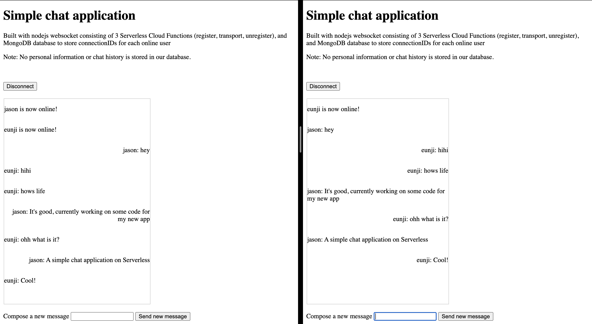

# Nodejs WebSocket

This is the template for a simple chat application. It is built using a Node.js socket made up of API gateway component with WEBSOCKET protocol and 3 SCF (Serverless Cloud Functions) functions, namely a register function, transport function and clean up function. It is also connected to a MongoDB database which is needed to store current connections to the websocket so that messages can be transmitted to all clients. A demo can be found [here](http://chat-bucket-1302554812.cos-website.ap-guangzhou.myqcloud.com/).



&nbsp;

1. [Prepare](#Prepare)
2. [Download](#Download)
3. [Bootstrap](#Bootstrap)
4. [Deploy](#Deploy)
5. [Remove](#Remove)

&nbsp;

### Prepare

Before all below steps, you should install
[Serverless Framework](https://www.github.com/serverless/serverless) globally:

```bash
$ npm i serverless -g
```

### Download

Severless cli is very convenient, it can download templates in any github
project which should contain `serverless.yml` file.

```bash
$ serverless init -t chat-app
```

### Bootstrap

Copy `.env.example` file to `.env` in project root:

Add the access keys of a
[Tencent CAM Role](https://console.cloud.tencent.com/cam/capi) with
`AdministratorAccess` in the `.env` file, like below:

```dotenv
# .env
TENCENT_SECRET_ID=xxx
TENCENT_SECRET_KEY=xxx

# change to your requirement
REGION=ap-guangzhou

MONGODB_URL=xxx
```

You can go to [MongoDB Atlas](https://account.mongodb.com/account/login) to make an account and a cluster, and copy the MONGO_URL to the cluster and paste it in the .env file. You will then need to install mongodb in all 3 folders containing the functions for the apigateway.

```bash
npm i mongodb
```

### Deploy

```bash
$ sls deploy

serverless ⚡ framework

chat-interface:
  region:        ap-guangzhou
  website:       http://chat-bucket-yyy.cos-website.ap-guangzhou.myqcloud.com
  vendorMessage: null

wsconnect:
  functionName:  wsconnect-dev
  description:   This is a function in chat-app application
  namespace:     default
  runtime:       Nodejs10.15
  handler:       connect.main_handler
  memorySize:    128
  lastVersion:   $LATEST
  traffic:       1
  triggers:
  vendorMessage: null

wsdisconnect:
  functionName:  wsdisconnect-dev
  description:   This is a function in chat-app application
  namespace:     default
  runtime:       Nodejs10.15
  handler:       disconnect.main_handler
  memorySize:    128
  lastVersion:   $LATEST
  traffic:       1
  triggers:
  vendorMessage: null

wstrans:
  functionName:  wstrans-dev
  description:   This is a function in chat-app application
  namespace:     default
  runtime:       Nodejs10.15
  handler:       transmit.main_handler
  memorySize:    128
  lastVersion:   $LATEST
  traffic:       1
  triggers:
  vendorMessage: null

websocketapi:
  protocols:     http&https
  subDomain:     service-xxx-yyy.gz.apigw.tencentcs.com
  environment:   release
  region:        ap-guangzhou
  serviceId:     service-xxx
  apis:
    -
      path:           /pgws
      method:         GET
      apiId:          abcd
      internalDomain: http://set-websocket.cb-common.apigateway.tencentyun.com/abcd
  vendorMessage: null

56s › chat-application › Success

```

After deploying, you will need to change line 55 of the chat-interface/client.html file to the subDomain of the websocketapi in order to be able to connect to the websocket that was just created. You will also need to change line 29 of function_wstrans/transmit.js to the internal domain of the websocketapi, which is the reverse push address of API Gateway. Then re-deploy those two instances.

Here, a MongoDB database was created on MongoDB Atlas and linked to the project using a MONGO_URL environment variable. However, you may also directly use [Tencent's Mongodb component](https://github.com/serverless-components/tencent-mongodb) to automatically create a Tencent Database for MongoDB. Then just uncomment the lines in the register, transport and clean up functions related to TCB (Tencent Database).

### Remove

```bash
$ sls remove

serverless ⚡ framework

15s › chat-app › Success
```
